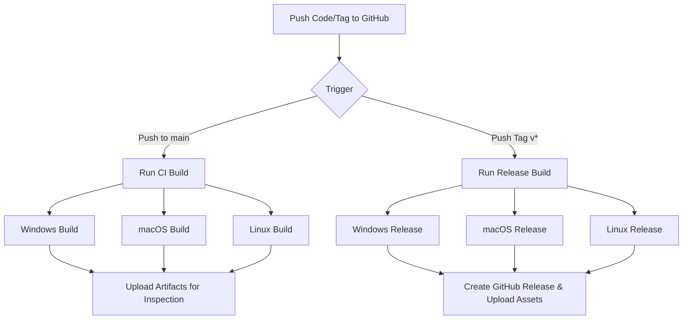

# GitHub Release Workflow Plan

This plan outlines the steps to implement a GitHub Actions workflow that automatically builds and releases the Kiosk Transaction Manager application for Windows, macOS, and Linux.

## 1. Prerequisites
- The repository must be hosted on GitHub.
- `GITHUB_TOKEN` is automatically provided by GitHub Actions for creating releases.

## 2. package.json Updates
We need to configure `electron-builder` to know how to publish the releases.
- Add `appId`: `com.kiosk.transaction-manager`
- Add `publish` provider: `github`
- Ensure `build` script is ready for production.

## 3. GitHub Actions Workflow (`.github/workflows/release.yml`)

### Strategy
A matrix build will be used to run the build process on native operating systems:
- `windows-latest`: Builds `.exe` (NSIS installer).
- `macos-latest`: Builds `.dmg` and `.zip`.
- `ubuntu-latest`: Builds `.AppImage` and `.deb`.

### Workflow Steps
1. **Checkout**: Pull the source code.
2. **Setup Node.js**: Install Node.js 20.x.
3. **Install Dependencies**: Run `npm install`.
4. **Build App**: Run `npm run build`.
5. **Publish**: Run `electron-builder --publish always`.
   - On `push` to `main`: It will verify the build works.
   - On `push` tags (e.g., `v1.0.0`): It will create a Draft Release on GitHub and upload the binaries.

## 4. Mermaid Diagram

## 5. Security & Signing
- **Code Signing**: Currently disabled per user request. Binaries will be unsigned.
- **Permissions**: The workflow will require `contents: write` permissions to create releases.
